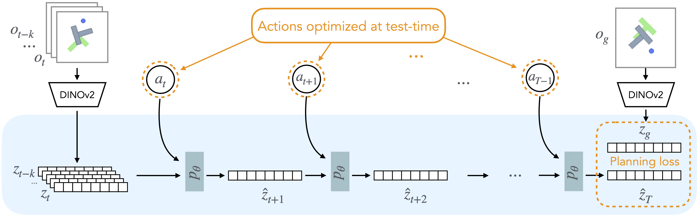
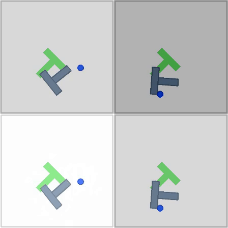
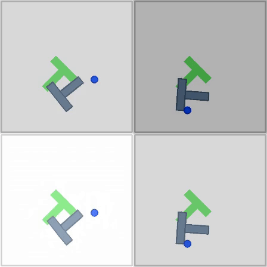
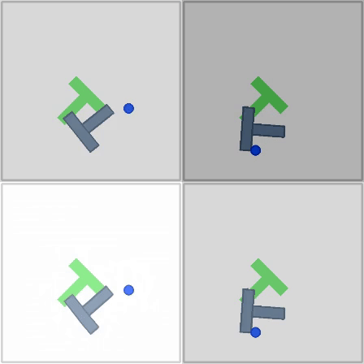
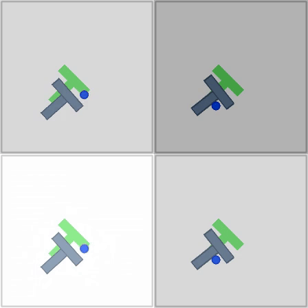
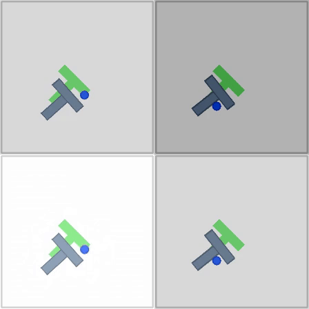
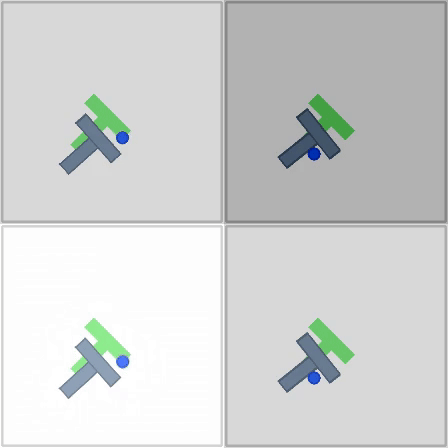

# Regulating DINO-WM with Optimal Transport

## Overview

We extend the DINO-WM framework introduced by Zhou et al. (2024) by incorporating Optimal Transport (OT) regularization to guide the planning process.

## Method

Our method builds upon DINO-WM, which leverages pre-trained DINOv2 visual features to create world models that can be used for zero-shot planning. Our approach constrains the world model's rollouts to follow shorter and more optimal trajectories by using interpolants in Wasserstein space as additional subtargets during planning.

## Optimal Transport
The optimal transport problem (OT) seeks a co-registration between two probability distributions $\delta(x)$ and $\mu(x)$, $x \in R^n$, in the form of an invertible map $y = T(x)$ such that the externally provided cost $c(x, T(x))$ of moving point $x$ to $T(x)$ is minimized. This idea is captured mathematically by the orignal formulation from Monge:

$$\min_T \left[ \int_{X} c(x,T(x)) \mathrm{d} \mu(x) |  T_x \delta = \mu \right]$$

Here $T_x \delta = \mu$ denotes a measure-preserving pushforward, which guarantees all mass is preserved.

We seek one-to-one correspondences, meaning entropy-regularized approximations like Sinkhorn's algorithm are undesired. Instead, we derive another method from Monge's formulation that allows us to capture interpolants in Wasserstein space.

we seek to minimize the global cost function:

$$L(x, y) = c(x,T(x)) - \gamma \left[ D_{KL}(\delta||\mu) \right]$$

where $\gamma$ is a regularization parameter enforcing the push-forward condition, which is represented with the Kullback-Liebler divergence - measuring relative entropy between the source distribution and the target distribution.

$$D_{KL}(\delta||\mu) = \int_{\mathbb{R}^n} \mu(x) \ln\frac{\delta(x)}{\mu(x)} dx \approx \sum_{i=1}^n \ln\frac{\delta(x_i)}{\mu(x_i)}$$

We employ kernel density estimation to acquire our probability density functions:

$$\delta(x_i)=\frac{1}{n}\sum_{j=1}^n K(T(x_i),T(x_j),H_x)$$

$$\mu(x_i)=\frac{1}{m}\sum_{k=1}^m K(T(x_i),y_k,H_y)$$

Here we use the multivariate Gaussian kernel:

$$K(x,\mu,\Sigma)=\frac{1}{\sqrt{(2\pi)^d \det(\Sigma)}} e^{-\frac{1}{2}(x-\mu) \Sigma^{-1} (x-\mu)^T }$$

where $\Sigma$ represents the diagonal covariance matrix, and $\mu$ denotes the center point of the kernel.

To measure distance from the source points $x$ to the mapped points $T(x)$, this project also uses the Euclidean distance, a canonical choice of cost in normed spaces.
$$c(x,T(x)) = \frac{1}{2n} \sum_{i=1}^n ||x_i - T(x_i)||^2_2$$
where $n$ is the number of observations and $d$ is the number of dimensions.

### Interpolation in Wasserstein Space
We use gradient descent to optimize the transport map. The process works as follows:
- Initialize the transport map $T(x)$ as the identity map or a simple linear mapping from source to target
- Compute the total cost function $L(x,y)$ by combining the transport cost and KL-divergence
- Calculate the gradient of the cost function with respect to the transport map parameters:

$$ \nabla_T L(x,y) = \nabla_T c(x,T(x)) − \gamma \nabla_T [D_{KL}(\mu || \delta) ] $$

Update the transport map using gradient descent:

$$ T^{(t+1)} = T^{(t)}−\eta \nabla_T L(x,y) $$

where $\eta$ is the learning rate, which is adapted to ensure the map reaches the desired goal state within some provided amount of steps.

For patch-based features, we generate intermediate waypoints between the source and target states for each patch by letting $T^{(t)} = z_t^{OT}$. 

We also use a linear interpolation between the final mapped state and current state and compare which method works best. 
- We calculate the transport-guided target for each patch using the OT plan: $z_{mapped} = T_final$
- For each timestep $t$, we interpolate: $z_t^{OT} = (1-\alpha) \cdot z_{source} + \alpha \cdot z_{mapped}$
- where $\alpha = t/(n\_{steps}+1)$ controls the interpolation ratio

The OT interpolant provides a direct path between the initial and goal states in the latent space, guiding the world model's predictions to follow more optimal trajectories.

We enhance the planning objective with an additional OT regularization term:

$$\text{Cost} = \||\hat{z}_T - z_g\|^2 + \lambda\|z_t^{OT} - \hat{z}_t\||^2$$

Where:
- $\hat{z}_T$ is the predicted latent state at the final timestep T
- $z_g$ is the goal latent state
- $z_t^{OT}$ is the OT interpolant at timestep t
- $\lambda$ is a parameter regulating how much the path should stay close to the OT map

## Model Predictive Control

We use the Cross-Entropy Method (CEM) for Model Predictive Control:

1. Encode current and goal observations into latent states
2. Sample initial action sequences
3. Predict future latents using the world model
4. Score sequences using our enhanced OT-regularized cost function
5. Use CEM to refine the action distribution
6. Execute the first action of the best sequence
7. Repeat the process

## Results

We evaluate the OT-regularized planning method on the PushT environment. Our approach demonstrates slight improvements in performance compared to baseline methods from the original DINO-WM implementation. We can note that the addition of OT regularization helps the world model find more direct paths to the goal - rounding corners more tightly and traversing more quickly. For each of the below animations, the top row displays the true observation from the PushT environment while the bottom row displays reconstructed from the latent state representations with a trained VQ-VAE decoder. The static image shows the desired goal state.

The leftmost animation below uses the planning implementation from the original DINO-WM implementation. The middle animation uses the gradient-step-based interpolation method. The rightmost animation uses the second linear interpolation method.

    

## Limitations

There are considerable drawbacks to this implementation. Chief among them is the increased computational cost due to optimal transport calculations being made at every initial planning step. Moreover, unrealistic interpolants will inevitably occur due to latent representations' inherent lack of understanding physical priors. This is demonstrated in the failure case here: 

   

The optimal mapping incentivizes the object to phase through the T-shape to reach its desired goal, yet doing so is physically impossible, and the model eventually fails to reach its target before a cutoff point established by the user (30 planning steps). Sensitivity to OT-based regularization is controlled by the $\lambda$ parameter. If the parameter is too high, then we get failure cases like above, where the model should first take suboptimal actions to reach its goal. The various additional parameters used in this method are generally quite sensitive and require careful tuning to perform well.

Ultimately, the method seems mostly ineffective on the short-range tasks included in these experiments. Although there are performance gains in the cases where it is successful, these are marginal and offset by higher compute requirements.
